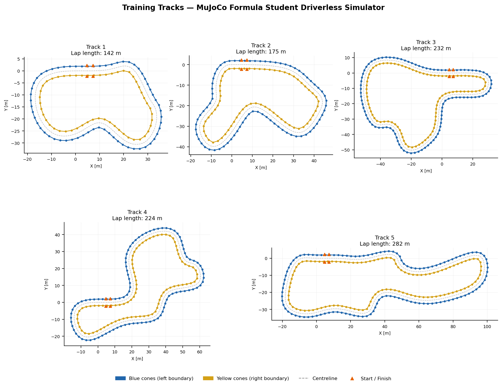
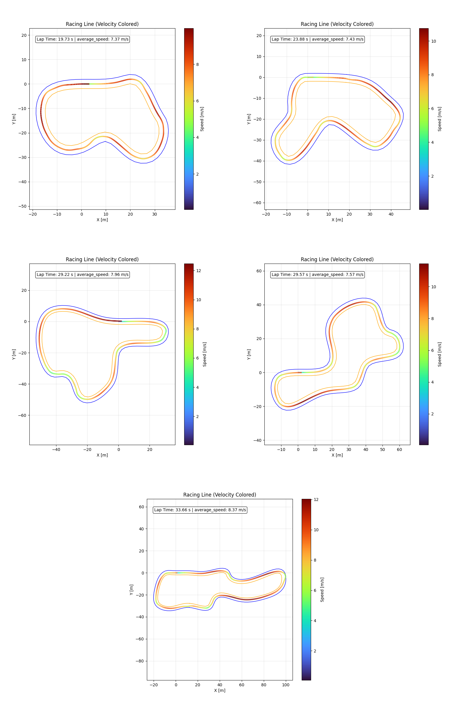

# MuJoCo Formula Student — RL Motion Control

> **FYP D127 · NTU MAE 2025/26 · Chan Mun Kit**
>
> Reinforcement Learning motion control for Formula Student Driverless (FSD) vehicles, trained in a custom MuJoCo simulation environment and benchmarked against a Pure Pursuit classical baseline.


---

## Overview

High-fidelity simulators (Gazebo, FSDS, FSSIM) are too slow for effective RL training. This project develops a lightweight MuJoCo FSD simulator that enables fast parallel training while remaining physically representative of the ADS-DV competition vehicle.

Three observation space configurations are evaluated under a 2×3 factorial design:

| Config | Name | Observation |
|--------|------|-------------|
| A | End-to-end | Camera image + 7D vehicle state |
| B | Relative waypoints | Config A + 5 upcoming waypoints as (Δx, Δy) |
| C | Distance waypoints | Config A + 5 scalar distances to waypoints |

Each is trained on both a **fixed track** and a **randomised set of 5 tracks**, then compared against a Pure Pursuit baseline that has privileged access to the full centreline.

---

## Training Tracks

Five procedurally generated tracks compliant with FSG geometric constraints (3 m min width, 9 m min turning radius, 200–500 m lap length):



| Track | Length | Difficulty | Key Features |
|-------|--------|------------|--------------|
| Track 1 | 142 m | Easiest | Wide radius, gentle curves |
| Track 2 | 175 m | Easy | Moderate curvature |
| Track 3 | 232 m | Medium | Mixed corners |
| Track 4 | 224 m | Medium | Tighter sections |
| Track 5 | 282 m | Hardest | Hairpin turns, chicanes |

---

## Pure Pursuit Baseline

A privileged classical controller with full centreline knowledge, achieving 100% completion on all tracks. Its racing lines are used as the reference benchmark.



---

## Architecture

### Simulation Environment

- **Physics engine:** MuJoCo 3.5
- **Vehicle:** ADS-DV — 140 kg, 1.530 m wheelbase, 1.201 m track width, ±30° steering, RWD
- **Track generation:** Procedural (Voronoi-based), FSG/FSI rule-compliant
- **Parallel envs:** 8 × `make_vec_env`
- **Frame skip:** 5 (effective control frequency: 66.7 Hz)

### Sensor Suite (ADS-DV)

| Sensor | Usage |
|--------|-------|
| ZED2i monocular RGB | 84×84 grayscale image (NatureCNN input) |
| IMU | Angular velocity ψ̇ |
| Wheel encoders | Velocities vₓ, vᵧ |
| GPS | Position (used internally for reward) |
| Velocimeter | Forward speed |

Sensor noise applied via MuJoCo's native noise attribute.

### Policy Network

```
Image (84×84×1)
    └─ NatureCNN ──────────────────────────────────┐
       Conv(8×8, s4, 32) → Conv(4×4, s2, 64)       │
       → Conv(3×3, s1, 64) → Linear(256)           │
                                                    ├─► Combined features ──► Actor MLP (64→64→2)
Vehicle state (7D) ──────────────────────────────── │                     └─► Critic MLP (64→64→1)
Waypoints (5D or 10D, if used) ─────────────────── ┘
```

- **Activation:** Tanh
- **Policy:** Diagonal Gaussian (continuous action space)
- **VecNormalize:** applied to state/waypoint keys only — image excluded to preserve uint8 range for NatureCNN routing

### Action Space

Continuous `[δ, τ] ∈ [−1, 1]²` — normalised steering angle and throttle.

### Reward Function

```
r_t = r_progress + r_velocity − r_step − r_steer − r_throttle − r_crash
```

| Component | Value |
|-----------|-------|
| Step penalty | −0.1 per step |
| Checkpoint reward | 10.0 / n per checkpoint |
| Velocity reward | 0.02 × vₓ |
| Steering penalty | 0.005 × |Δδ| |
| Crash penalty | −50.0 (terminal) |

**Termination:** cone collision (terminated) or no checkpoint in 200 steps (truncated, stuck detection).

---

## Experiments

A 2×3 factorial design: 3 observation configurations × 2 map conditions.

| ID | Observation | Map | Notes |
|----|-------------|-----|-------|
| Exp1 | End-to-end | Fixed Track 5 | 50 checkpoints |
| Exp2 | Relative WP | Fixed Track 5 | 20 checkpoints |
| Exp3 | Distance WP | Fixed Track 5 | 20 checkpoints |
| Exp4 | End-to-end | Random (T1–5) | 50 checkpoints |
| Exp5 | Relative WP | Random (T1–5) | 20 checkpoints |
| Exp6 | Distance WP | Random (T1–5) | 20 checkpoints |

All experiments: **5M timesteps**, 8 parallel envs.

### PPO Hyperparameters

| Parameter | Value |
|-----------|-------|
| n_steps | 2048 |
| Batch size | 512 |
| n_epochs | 10 |
| Learning rate | 1×10⁻⁴ |
| Discount γ | 0.99 |
| GAE λ | 0.95 |
| Clip ε | 0.2 |
| Target KL | 0.05 |
| Entropy coef | 0.01 |

---

## Results

Evaluation over 25 deterministic episodes per track (5 tracks × 5 seeds).

### Overall Performance

| Agent | Observation | Map | Completion ↑ | Crash ↓ | Speed (m/s) ↑ | Lap Time (s) ↓ |
|-------|-------------|-----|:------------:|:-------:|:-------------:|:---------------:|
| **Pure Pursuit** | Classical | All | **100%** | 0% | 7.74 | 27.2 |
| Exp1 | End-to-end | Fixed T5 | **72%** | 40% | 6.32 | 33.8 |
| Exp2 | Relative WP | Fixed T5 | 24% | 88% | 6.94 | 30.0 |
| Exp3 | Distance WP | Fixed T5 | 48% | 80% | 7.20 | 27.3 |
| Exp4 | End-to-end | Random | 52% | **32%** | 4.92 | 34.7 |
| Exp5 | Relative WP | Random | 28% | 92% | 7.18 | 21.1 |
| Exp6 | Distance WP | Random | 56% | 92% | **7.53** | 25.2 |

### Per-Track Completion (%)

| | T1 | T2 | T3 | T4 | T5 |
|---|:--:|:--:|:--:|:--:|:--:|
| Pure Pursuit | 100 | 100 | 100 | 100 | 100 |
| Exp1 | 40 | 60 | 100 | 80 | **80** |
| Exp2 | 40 | 0 | 60 | 20 | 20 |
| Exp3 | 40 | 80 | 100 | 20 | 20 |
| Exp4 | 80 | 60 | 100 | 20 | 0 |
| Exp5 | 100 | 60 | 20 | 0 | 0 |
| Exp6 | 80 | 80 | 100 | 60 | 0 |

### Lap Time vs Pure Pursuit (simple tracks)

| Track | Pure Pursuit | Exp5 (Rel. WP) | Exp6 (Dist. WP) |
|-------|:-----------:|:--------------:|:----------------:|
| T1 (142 m) | 19.7 s | 18.5 s (−6%) | **18.2 s (−8%)** |
| T2 (175 m) | 23.9 s | 22.0 s (−8%) | **21.4 s (−10%)** |
| T3 (232 m) | 29.2 s | 29.8 s (+2%) | 29.0 s (−0.7%) |
| T4 (224 m) | 29.6 s | DNF | 29.7 s (+0.3%) |
| T5 (282 m) | 33.7 s | DNF | DNF |

Waypoint-conditioned agents exceed Pure Pursuit on simple tracks by approximating an out-in-out racing line, while PP is geometrically constrained to the centreline.

---

## Key Findings

1. **Distance waypoints achieve the best speed and completion at 5M steps** — Exp6: 7.53 m/s, 56% completion, within 3% of Pure Pursuit average speed.

2. **Relative waypoints learn faster but degrade with longer training** — peak 60–64% completion at 2M steps, falling to 24–28% by 5M. Attributed to velocity reward gradient dominating the terminal crash penalty as the policy matures.

3. **End-to-end agents are slowest but most reliable** — Exp1 highest completion (72%), Exp4 lowest crash rate (32%). Absence of path guidance produces a conservative reactive policy.

4. **Waypoint agents beat Pure Pursuit lap times on T1–T2** by up to 10%, demonstrating learned racing line behaviour.

5. **Track 5 (hardest) is only solved by the agent trained exclusively on it** — Exp1 achieves 80% on T5; generalised policies score 0%.

6. **Steering penalty (0.05 vs 0.005) improves completion 2.4–2.5× at 2M steps** with no significant speed penalty. Mean steer change: end-to-end agents 0.81–1.11 vs waypoint agents 0.16–0.20.

---

## Installation

### Prerequisites

- Python 3.12
- MuJoCo 3.5+ (free, [install guide](https://mujoco.readthedocs.io/en/stable/))
- CUDA-capable GPU (recommended)

### Setup

```bash
git clone https://github.com/your-username/MujocoFormulaStudent.git
cd MujocoFormulaStudent
git submodule update --init --recursive   # pulls random-track-generator

python -m venv fs_gym
# Windows
fs_gym\Scripts\activate
# Linux/macOS
source fs_gym/bin/activate

pip install -r requirments.txt
```

---

## Usage

### Training

```bash
cd scripts
python train.py
```

Key config options (edit `config/train.yaml`):

```yaml
env:
  waypoint_mode: "distance"   # "none" | "relative" | "distance"
  domain_randomization: true  # true = random track each episode
  track_idx:                  # null = random, or 1-5 for fixed track
  num_checkpoints: 20         # reward gates around track
  num_envs: 8                 # parallel environments

ppo:
  total_timesteps: 5_000_000
  learning_rate: 1e-4
  target_kl: 0.05
```

### Evaluation

```bash
cd scripts
python new_new_eval.py
```

### Pure Pursuit Baseline

```bash
cd scripts
python baseline.py
```

---

## Project Structure

```
MujocoFormulaStudent/
├── config/
│   ├── train.yaml              # Training hyperparameters and env config
│   └── eval.yaml               # Evaluation config
│
├── scripts/
│   ├── env.py                  # Gymnasium environment (MujocoFormulaStudent)
│   ├── train.py                # PPO training entry point (Hydra + WandB)
│   ├── baseline.py             # Pure Pursuit classical controller
│   ├── controller.py           # Steering/throttle controller utilities
│   ├── utils.py                # Wrappers (ForceForwardWrapper, GrayscaleDictObservation)
│   ├── env_test.py             # Environment sanity checks
│   ├── new_new_eval.py         # Evaluation script (racing line + telemetry plots)
│   └── archieve/               # Deprecated scripts (graph.py, new_eval.py, etc.)
│
├── mujoco_tracks/
│   ├── sim_env.xml             # Main simulation scene
│   ├── formula_student/        # ADS-DV car model + meshes
│   ├── cars/                   # Mushr base car (legacy)
│   └── track_{1..5}/          # Track definitions (XML + centreline CSV)
│
├── random-track-generator/     # Submodule — procedural track generator
│   └── random_track_generator/ # FSG/FSI-compliant Voronoi track generation
│
├── report/                     # Experiment results (racing line PNGs, telemetry, results.json)
│   ├── 1_no_waypoint_constant_track/
│   ├── 2_relative_waypoint_constant_track/
│   ├── 3_distance_waypoint_constant_track/
│   ├── 4_no_waypoint_random_track/
│   └── 5_relative_waypoint_random_track/
│
├── doc/
│   ├── training_tracks.png     # Overview of 5 training tracks
│   ├── baseline/               # Pure Pursuit racing line + telemetry plots
│   ├── ads_resume/             # ADS-DV fine-tuning results
│   └── archieve/               # Intermediate experiment plots (early training runs)
│
├── old_tracks/                 # Previous track versions (superseded by mujoco_tracks/)
├── requirments.txt             # Python dependencies
└── .gitignore
```

**Gitignored (not in repo):** `models/`, `good_model/`, `logs/`, `videos/`, `wandb/`, `outputs/`, `fs_gym/`

---

## Critical Training Fixes

Issues encountered during development and their resolutions:

| Issue | Symptom | Fix |
|-------|---------|-----|
| KL divergence instability | KL > 1.5, clip fraction > 60% | LR 3×10⁻³ → 1×10⁻⁴, target_kl = 0.05 |
| Image normalisation bug | SB3 routing image through Flatten/MLP | Exclude image from `norm_obs_keys` in VecNormalize |
| Reward hacking (stationary) | Agent stops to avoid crash penalty | Stuck detection: truncate after 200 steps without checkpoint |
| Reward hacking (track memorisation) | Agent memorises single track | Random-track training (Exp4–6) |
| Entropy collapse | Policy std rising above 1.0 | ent_coef 0.02 → 0.01 |
| Slow convergence | Insufficient on-policy data | n_steps 1024 → 2048 |

---

## Citation

```bibtex
@misc{chan2026mujocoformulastudent,
  author    = {Chan, Mun Kit},
  title     = {Motion Control of Autonomous Driving Based on Reinforcement Learning},
  year      = {2026},
  note      = {Final Year Project D127, Nanyang Technological University, School of Mechanical and Aerospace Engineering},
}
```

---

## License

Apache License 2.0 — see [LICENSE](LICENSE).
